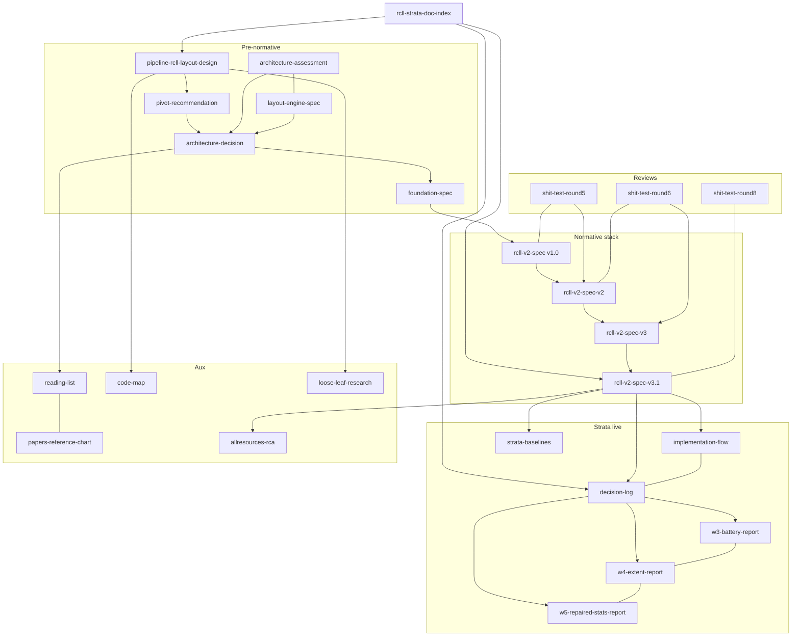

# RCLL / Strata — document graph index

Agent entry point for the RCLL → Strata layout-engine documentation cluster. Traverse via each doc’s **Document graph** block (Parent / Children / Sisters). Relative links only.

## Document graph

| Relation | Link |
| --- | --- |
| Role | Hub |
| Status | Current — catalog only; not normative |
| Hub | This file |
| Parent | — |
| Children | Full catalog below (every cluster file) |
| Sisters | — |
| Next (agent) | Pick a task row in **Start here by task**, then follow Parent→Children from that entry |

## Precedence (normative)

On conflict: **[`rcll-v2-spec-v3.1.md`](./rcll-v2-spec-v3.1.md) > [`rcll-v2-spec-v3.md`](./rcll-v2-spec-v3.md) > [`rcll-v2-spec-v2.md`](./rcll-v2-spec-v2.md)**.

As-built register (what shipped): [`strata-view-decision-log.md`](./strata-view-decision-log.md). Build plan: [`strata-view-implementation-flow.md`](./strata-view-implementation-flow.md).

## Role legend

| Role | Meaning |
| --- | --- |
| Hub | This index |
| Normative-base | Current algorithm/build contract (v2.0) |
| Normative-amendment | Amendment layer (v3.0 / v3.1); later wins |
| Superseded | Historical; do not treat as current law |
| Review | Adversarial evidence; dispositions may be overridden by later specs |
| As-built-RFC | Living SoT for the **shipped** `view=rcll` engine only |
| Decision | Architecture / product decision trail |
| Companion | Implementation / living decision log |
| Battery | Milestone measurement report |
| Aux | Research, papers, code map, RCA — cite, don’t build from |

## Start here by task

| Task | Start | Then |
| --- | --- | --- |
| Implement / modify Strata | [`rcll-v2-spec-v3.1.md`](./rcll-v2-spec-v3.1.md) §0 | v2.0 algorithms → v3.0 amendments → decision-log Part II |
| What shipped / what’s left | [`strata-view-decision-log.md`](./strata-view-decision-log.md) | W3/W4 battery reports |
| Lineage / why a decision | This hub → architecture-decision → round5/round6 | Never treat reviews as current law |
| As-built RCLL v1 (`view=rcll`) | [`pipeline-rcll-layout-design.md`](./pipeline-rcll-layout-design.md) | [`rcll-code-map.md`](./rcll-code-map.md) |
| Literature / citations | [`rcll-reading-list.md`](./rcll-reading-list.md) | papers chart; round6 for Forster correction |

## Do not treat as current law

- [`pipeline-rcll-v2-pivot-recommendation.md`](./pipeline-rcll-v2-pivot-recommendation.md) (superseded)
- [`rcll-v2-foundation-spec.md`](./rcll-v2-foundation-spec.md) (superseded by v1.0)
- [`rcll-v2-spec.md`](./rcll-v2-spec.md) (v1.0 superseded by v2.0)
- Round-5 / round-6 / round-8 reports (evidence only; a later spec amendment may override dispositions)

## Full catalog

| Doc | Role | Status | One-line |
| --- | --- | --- | --- |
| [`rcll-strata-doc-index.md`](./rcll-strata-doc-index.md) | Hub | Current | Agent entry / catalog |
| [`pipeline-rcll-layout-design.md`](./pipeline-rcll-layout-design.md) | As-built-RFC | Living (RCLL v1) | Shipped `view=rcll` RFC |
| [`pipeline-rcll-v2-pivot-recommendation.md`](./pipeline-rcll-v2-pivot-recommendation.md) | Superseded | Superseded | Oldest pivot memo |
| [`rcll-architecture-assessment-report.md`](./rcll-architecture-assessment-report.md) | Decision | Historical | Architect findings |
| [`rcll-layout-engine-spec.md`](./rcll-layout-engine-spec.md) | Decision | Historical | A-stay vs B-rebuild frame |
| [`rcll-v2-architecture-decision.md`](./rcll-v2-architecture-decision.md) | Decision | Historical | Rounds 1–4 decisions |
| [`rcll-v2-foundation-spec.md`](./rcll-v2-foundation-spec.md) | Superseded | Superseded | Foundation F1–F10 |
| [`rcll-v2-spec.md`](./rcll-v2-spec.md) | Superseded | Superseded by v2.0 | Normative v1.0 |
| [`rcll-v2-shit-test-round5.md`](./rcll-v2-shit-test-round5.md) | Review | Evidence-only | Attacked v1.0 → produced v2.0 |
| [`rcll-v2-spec-v2.md`](./rcll-v2-spec-v2.md) | Normative-base | Current (base) | Algorithms + build order |
| [`rcll-v2-shit-test-round6.md`](./rcll-v2-shit-test-round6.md) | Review | Evidence-only | Attacked v2.0 → produced v3.0 |
| [`rcll-v2-spec-v3.md`](./rcll-v2-spec-v3.md) | Normative-amendment | Current (amend) | Slice metrics + A2/A7 rescope |
| [`rcll-v2-spec-v3.1.md`](./rcll-v2-spec-v3.1.md) | Normative-amendment | Current (top) | Round-7 pins + freeze registers |
| [`rcll-v2-shit-test-round8.md`](./rcll-v2-shit-test-round8.md) | Review | Evidence-only | Cross-model (codex gpt-5.6-sol ×3) audit of v3.1 stack + roadmap |
| [`rcll-v2-gate-family-v3.2-proposal.md`](./rcll-v2-gate-family-v3.2-proposal.md) | Decision | Pending owner adjudication | Consolidated codex+Fable literature-grounded gate family (Ware path-cost headline) fixing R8-F1/F3/F6 |
| [`strata-view-decision-log.md`](./strata-view-decision-log.md) | Companion | Living | As-built SDEC register |
| [`strata-view-implementation-flow.md`](./strata-view-implementation-flow.md) | Companion | Living | How to build each piece |
| [`strata-view-w3-battery-report.md`](./strata-view-w3-battery-report.md) | Battery | Historical | M1b / V2 battery |
| [`strata-view-w4-extent-report.md`](./strata-view-w4-extent-report.md) | Battery | Historical | OD-14 / V3 extent closure |
| [`strata-view-w5-repaired-stats-report.md`](./strata-view-w5-repaired-stats-report.md) | Battery | Current | Repaired p50/p90 stats + first M-RT (Ware path-cost) battery |
| [`strata-view-w5b-joint-ns-probe.md`](./strata-view-w5b-joint-ns-probe.md) | Battery | Current | R8-F9 joint constrained-NS probe — feasible but NO-GO vs sequential RS |
| [`strata-baselines/README.md`](./strata-baselines/README.md) | Battery | Current (frozen) | S0b baseline JSON pins |
| [`rcll-reading-list.md`](./rcll-reading-list.md) | Aux | Living | Literature reading list |
| [`rcll-papers-reference-chart.md`](./rcll-papers-reference-chart.md) | Aux | Living | Built vs rejected papers |
| [`rcll-code-map.md`](./rcll-code-map.md) | Aux | Living | RCLL code anchors |
| [`rcll-loose-leaf-edge-length-research.md`](./rcll-loose-leaf-edge-length-research.md) | Aux | Historical | Loose-leaf Y research |
| [`terraform-pipeline-rcll-v2-allresources-rca.md`](./terraform-pipeline-rcll-v2-allresources-rca.md) | Aux | Historical | Prep O(N²) RCA → T10 |

## Lineage graph

