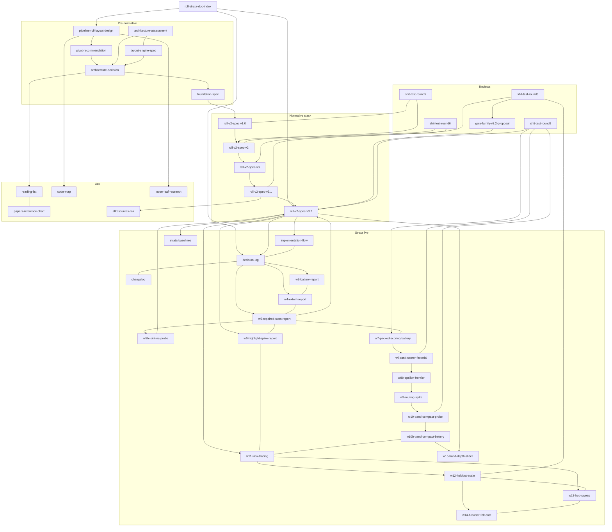

# RCLL / Strata — document graph index

Agent entry point for the RCLL → Strata layout-engine documentation cluster. Traverse via each doc’s **Document graph** block (Parent / Children / Sisters). Relative links only.

## Document graph

| Relation | Link |
| --- | --- |
| Role | Hub |
| Status | Current — catalog only; not normative |
| Hub | This file |
| Parent | — |
| Children | Full catalog below (every cluster file) |
| Sisters | — |
| Next (agent) | Pick a task row in **Start here by task**, then follow Parent→Children from that entry |

## Precedence (normative)

On conflict: **[`rcll-v2-spec-v3.2.md`](./rcll-v2-spec-v3.2.md) > [`rcll-v2-spec-v3.1.md`](./rcll-v2-spec-v3.1.md) > [`rcll-v2-spec-v3.md`](./rcll-v2-spec-v3.md) > [`rcll-v2-spec-v2.md`](./rcll-v2-spec-v2.md)**.

As-built register (what shipped): [`strata-view-decision-log.md`](./strata-view-decision-log.md). Build plan: [`strata-view-implementation-flow.md`](./strata-view-implementation-flow.md).

## Role legend

| Role | Meaning |
| --- | --- |
| Hub | This index |
| Normative-base | Current algorithm/build contract (v2.0) |
| Normative-amendment | Amendment layer (v3.0 / v3.1); later wins |
| Superseded | Historical; do not treat as current law |
| Review | Adversarial evidence; dispositions may be overridden by later specs |
| As-built-RFC | Living SoT for the **shipped** `view=rcll` engine only |
| Decision | Architecture / product decision trail |
| Companion | Implementation / living decision log |
| Battery | Milestone measurement report |
| Aux | Research, papers, code map, RCA — cite, don’t build from |

## Start here by task

| Task | Start | Then |
| --- | --- | --- |
| Implement / modify Strata | [`rcll-v2-spec-v3.2.md`](./rcll-v2-spec-v3.2.md) §0 | v3.1 pins → v2.0 algorithms → v3.0 amendments → decision-log Part II |
| Gate / measure a milestone | [`rcll-v2-spec-v3.2.md`](./rcll-v2-spec-v3.2.md) §1–§3, §8 | gate-family proposal (adopted) → strata-baselines README |
| What shipped / what’s left | [`strata-view-decision-log.md`](./strata-view-decision-log.md) | W3/W4 battery reports |
| Lineage / why a decision | This hub → architecture-decision → round5/round6 | Never treat reviews as current law |
| As-built RCLL v1 (`view=rcll`) | [`pipeline-rcll-layout-design.md`](./pipeline-rcll-layout-design.md) | [`rcll-code-map.md`](./rcll-code-map.md) |
| Literature / citations | [`rcll-reading-list.md`](./rcll-reading-list.md) | papers chart; round6 for Forster correction |

## Do not treat as current law

- [`pipeline-rcll-v2-pivot-recommendation.md`](./pipeline-rcll-v2-pivot-recommendation.md) (superseded)
- [`rcll-v2-foundation-spec.md`](./rcll-v2-foundation-spec.md) (superseded by v1.0)
- [`rcll-v2-spec.md`](./rcll-v2-spec.md) (v1.0 superseded by v2.0)
- Round-5 / round-6 / round-8 / round-9 reports (evidence only; a later spec amendment may override dispositions)

## Full catalog

| Doc | Role | Status | One-line |
| --- | --- | --- | --- |
| [`rcll-strata-doc-index.md`](./rcll-strata-doc-index.md) | Hub | Current | Agent entry / catalog |
| [`pipeline-rcll-layout-design.md`](./pipeline-rcll-layout-design.md) | As-built-RFC | Living (RCLL v1) | Shipped `view=rcll` RFC |
| [`pipeline-rcll-v2-pivot-recommendation.md`](./pipeline-rcll-v2-pivot-recommendation.md) | Superseded | Superseded | Oldest pivot memo |
| [`rcll-architecture-assessment-report.md`](./rcll-architecture-assessment-report.md) | Decision | Historical | Architect findings |
| [`rcll-layout-engine-spec.md`](./rcll-layout-engine-spec.md) | Decision | Historical | A-stay vs B-rebuild frame |
| [`rcll-v2-architecture-decision.md`](./rcll-v2-architecture-decision.md) | Decision | Historical | Rounds 1–4 decisions |
| [`rcll-v2-foundation-spec.md`](./rcll-v2-foundation-spec.md) | Superseded | Superseded | Foundation F1–F10 |
| [`rcll-v2-spec.md`](./rcll-v2-spec.md) | Superseded | Superseded by v2.0 | Normative v1.0 |
| [`rcll-v2-shit-test-round5.md`](./rcll-v2-shit-test-round5.md) | Review | Evidence-only | Attacked v1.0 → produced v2.0 |
| [`rcll-v2-spec-v2.md`](./rcll-v2-spec-v2.md) | Normative-base | Current (base) | Algorithms + build order |
| [`rcll-v2-shit-test-round6.md`](./rcll-v2-shit-test-round6.md) | Review | Evidence-only | Attacked v2.0 → produced v3.0 |
| [`rcll-v2-spec-v3.md`](./rcll-v2-spec-v3.md) | Normative-amendment | Current (amend) | Slice metrics + A2/A7 rescope |
| [`rcll-v2-spec-v3.1.md`](./rcll-v2-spec-v3.1.md) | Normative-amendment | Current (amend) | Round-7 pins + freeze registers |
| [`rcll-v2-shit-test-round8.md`](./rcll-v2-shit-test-round8.md) | Review | Evidence-only | Cross-model (codex gpt-5.6-sol ×3) audit of v3.1 stack + roadmap |
| [`rcll-v2-gate-family-v3.2-proposal.md`](./rcll-v2-gate-family-v3.2-proposal.md) | Decision | Adopted as v3.2 | Consolidated codex+Fable literature-grounded gate family (Ware path-cost headline) fixing R8-F1/F3/F6 |
| [`rcll-v2-spec-v3.2.md`](./rcll-v2-spec-v3.2.md) | Normative-amendment | Current (top) | Repaired statistics contract + gate register + M-RT family + default/OD re-scopes |
| [`rcll-v2-shit-test-round9.md`](./rcll-v2-shit-test-round9.md) | Review | Evidence-only | Packed-hull crossing objective structurally blind — experiment-confirmed (owner case: 123→120 vs counter 0→0) |
| [`strata-view-decision-log.md`](./strata-view-decision-log.md) | Companion | Living | As-built SDEC register |
| [`strata-view-implementation-flow.md`](./strata-view-implementation-flow.md) | Companion | Living | How to build each piece |
| [`strata-view-changelog.md`](./strata-view-changelog.md) | Companion | Living | Chronological shipped-change register (commit → change → toggle → evidence) |
| [`strata-view-w3-battery-report.md`](./strata-view-w3-battery-report.md) | Battery | Historical | M1b / V2 battery |
| [`strata-view-w4-extent-report.md`](./strata-view-w4-extent-report.md) | Battery | Historical | OD-14 / V3 extent closure |
| [`strata-view-w5-repaired-stats-report.md`](./strata-view-w5-repaired-stats-report.md) | Battery | Current | Repaired p50/p90 stats + first M-RT (Ware path-cost) battery |
| [`strata-view-w5b-joint-ns-probe.md`](./strata-view-w5b-joint-ns-probe.md) | Battery | Current | R8-F9 joint constrained-NS probe — feasible but NO-GO vs sequential RS |
| [`strata-view-w6-highlight-spike-report.md`](./strata-view-w6-highlight-spike-report.md) | Battery | Current (owner-eval pending) | v3.2 §8 highlight-spike crossover sweep — v2+HL vs unaided strata-I |
| [`strata-view-w7-packed-scoring-battery.md`](./strata-view-w7-packed-scoring-battery.md) | Battery | Current (owner adjudication pending) | Round-9 remedy battery — strataPackedScoring vs I/v2; default-on candidate w/ paired-tail churn cells open |
| [`strata-view-w8-rank-scorer-factorial.md`](./strata-view-w8-rank-scorer-factorial.md) | Battery | Current | Rank×scorer factorial — RS×packedScoring interaction regresses the owner case (scorer wins are substrate-conditional); ALL≡P_RS (NS suppressed) |
| [`strata-view-w8b-epsilon-frontier.md`](./strata-view-w8b-epsilon-frontier.md) | Battery | Current (owner adjudication pending on δ) | ε-constraint selector + candidate frontier — present-but-rejected CONFIRMED (crossings term vetoes (pen,L1)-better candidates mid-descent); δ=1 recovers the owner pair under RS at a p90 cost; δ sweep saturates at 1 |
| [`strata-view-w9-routing-spike.md`](./strata-view-w9-routing-spike.md) | Battery | Current (owner adjudication pending) | Package C routing spike — penetrating-only detours zero penetrations on every ROUTED edge (scene residual = unroutable-cap chords, best −72%) but scene crossings jump 2.4–3.4× and rt̂ worsens p50+p90 on every arm; default-off `strataEdgeRouting` |
| [`strata-view-w10-band-compact-probe.md`](./strata-view-w10-band-compact-probe.md) | Battery | Current (Stage 2 open, deferred) | OD-15 re-scope Stage-1 ceiling probe — banded-hull Y-waste is material under rankSeparate (46.6–52.7% reclaim) but zero without it; WAF→ELB unhelped (intra-region invariant); `strataBandCompact` registered, deferred behind ε/routing/W7 adjudications |
| [`strata-view-w10b-band-compact-battery.md`](./strata-view-w10b-band-compact-battery.md) | Battery | Current (owner adjudication pending) | OD-15 re-scope Stage-2 — `strataBandCompact` SHIPPED (default OFF); real reclaim under RS (P1 −7446px, P2 −3800px) at an rt̂ p50+p90 tax and worsening add-churn; PS-on-final-substrate improves rt̂ p50/crossings both presets w/ residual p90 tax; ε=1 confirmed not-inert but adverse on every axis; 3-model panel VALIDATED-WITH-FIXES; all three adjudications ready for owner |
| [`strata-view-w11-task-tracing.md`](./strata-view-w11-task-tracing.md) | Battery | Current (Q7-AXIS labeling open exit criterion) | Directed relationship-focus traversal + Q7-AXIS blinded instrument + task-tracing battery, all default-off/REPORT-only — shipped undirected 3-hop click-highlight quantified task-mismatched (precision ~0.46–0.48, recall ~0.68–0.74) vs the modeled directed cone; production-call validation precision=recall=1.0 unfiltered; Q7-AXIS owner labeling standing open |
| [`strata-view-w12-heldout-scale.md`](./strata-view-w12-heldout-scale.md) | Battery | Current (interpretation BLOCKED-ON-Q7; R8-F4 open) | Out-of-tuning-distribution transfer + full-detail scale battery — synthetic P3 (`staging-heldout-mesh`, claim-scoped: NOT held-out closure); mechanical transfer blockVerdict SUPPORT (in-sample direction reproduces, against the strata arms); full-detail extent frozen-VOID by construction (M3 port = the pairing unlock); browser felt-cost trace appendix |
| [`strata-view-w13-hop-sweep.md`](./strata-view-w13-hop-sweep.md) | Battery | Current (BUILT+RUN; interpretation BLOCKED-ON-Q7) | Hop-depth K × direction sweep for relationship focus — frozen recommendation rule (smallest K w/ macro precision ≥0.90 AND recall ≥0.95 on BOTH P1/P2, else keep default 3) KEEPS default 3 (`dependencies` needs K=9, `dependents` K=10, `both` never qualifies; P3 confirmatory disagrees, reported not re-selected); per-direction truth builders, W12-artifact sanity anchors exact-green; population-match evidence only, NOT task evidence — SDEC-67 |
| [`strata-view-w14-browser-felt-cost.md`](./strata-view-w14-browser-felt-cost.md) | Battery | BUILT+RUN | Browser felt-cost milestone — always-on `withTerraformPlanNodeKeyIndex` scope extension (parsing + skeleton materialization + topology resolvers) + `pipelineFull` worker offload (codex F1 fix: strata was missing from the worker dispatch predicate, now fixed); felt import 15.1s→≈6.9-7.5s pre-fix, single blocking main-thread task ELIMINATED post-fix (0/3 long tasks); `terraformModulePrefixForAddress` (~2.1s) and `workerError:1` fallback (uncorrelated w/ blocking) named open follow-ups; REPORT-only, no gate/threshold |
| [`strata-view-w15-band-depth-slider.md`](./strata-view-w15-band-depth-slider.md) | Companion | BUILT+RUN | `banded`/`packed` role map + the default-off `strataBandCompact` boolean generalized into one monotone cut `strataBandDepth` (root..subnetZone, default `"account"`, byte-identical to prior output), fully-generic resolved-policy model (every consumer — A0/A7/A2/packed-scoring/slice-metrics — reads one `hull.policy`), real range slider UI; owner flags: legacy `strataBandCompact=true` output changes (aliases to root cut, provider/account become packed-eligible) and the bandCompact battery's slice-B metric empties for `_BC`/root-cut arms — both interact with the open W10b adjudication |
| [`strata-baselines/README.md`](./strata-baselines/README.md) | Battery | Current (frozen) | S0b baseline JSON pins |
| [`rcll-reading-list.md`](./rcll-reading-list.md) | Aux | Living | Literature reading list |
| [`rcll-papers-reference-chart.md`](./rcll-papers-reference-chart.md) | Aux | Living | Built vs rejected papers |
| [`rcll-code-map.md`](./rcll-code-map.md) | Aux | Living | RCLL code anchors |
| [`rcll-loose-leaf-edge-length-research.md`](./rcll-loose-leaf-edge-length-research.md) | Aux | Historical | Loose-leaf Y research |
| [`terraform-pipeline-rcll-v2-allresources-rca.md`](./terraform-pipeline-rcll-v2-allresources-rca.md) | Aux | Historical | Prep O(N²) RCA → T10 |

## Lineage graph

